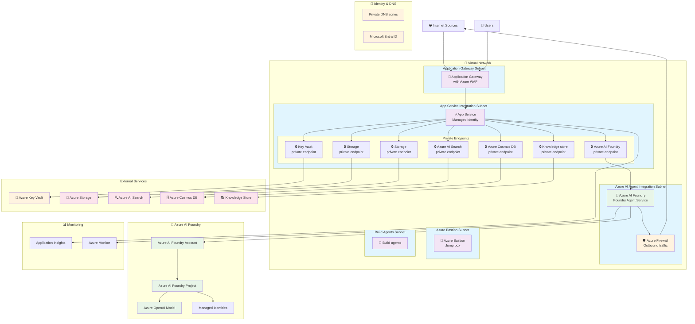
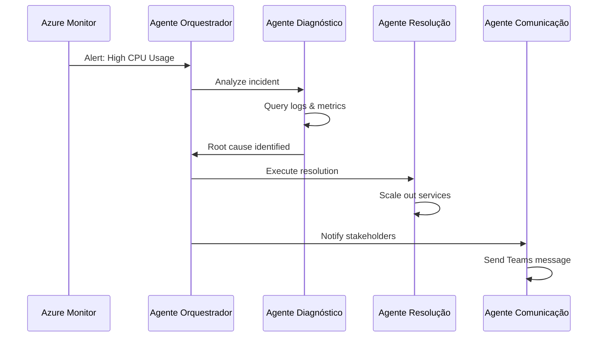
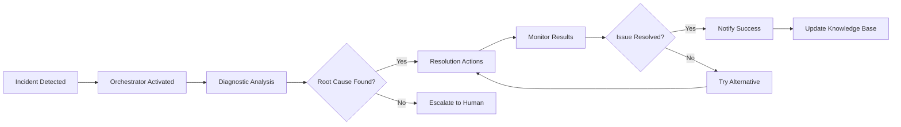

# Arquitetura do Sistema Phoenix

## Visão Geral da Arquitetura

O sistema Phoenix implementa uma arquitetura de microserviços distribuída na Azure, com agentes inteligentes orquestrados pelo Azure AI Foundry para resolução autônoma de incidentes.

## Diagrama da Arquitetura



## Componentes da Arquitetura

### 1. Camada de Rede (Virtual Network)

#### Application Gateway Subnet
- **Application Gateway com WAF**: Ponto de entrada para tráfego externo
- **Azure WAF**: Proteção contra ataques web comuns
- **Load Balancing**: Distribuição de tráfego

#### App Service Integration Subnet
- **App Service**: Hospedagem da aplicação principal
- **Managed Identity**: Autenticação segura sem credenciais
- **Private Endpoints**: Conectividade privada com serviços Azure

#### Azure AI Agent Integration Subnet
- **Azure AI Foundry**: Orquestração dos agentes inteligentes
- **Foundry Agent Service**: Execução dos agentes especializados
- **Azure Firewall**: Controle de tráfego de saída

### 2. Agentes Inteligentes

#### Agente Orquestrador
```python
# Exemplo de configuração
orchestrator_config = {
    "name": "Phoenix Orchestrator",
    "triggers": ["performance_alert", "error_spike", "resource_exhaustion"],
    "coordination_strategy": "priority_based",
    "escalation_timeout": 30
}
```

#### Agente de Diagnóstico
```python
diagnostic_config = {
    "name": "Phoenix Diagnostic",
    "data_sources": ["app_insights", "log_analytics", "metrics"],
    "analysis_models": ["anomaly_detection", "root_cause_analysis"],
    "confidence_threshold": 0.85
}
```

#### Agente de Resolução
```python
resolution_config = {
    "name": "Phoenix Resolution",
    "actions": ["scale_out", "restart_service", "clear_cache", "optimize_queries"],
    "approval_required": ["scale_beyond_limit", "restart_critical_service"],
    "rollback_strategy": "automatic"
}
```

#### Agente de Comunicação
```python
communication_config = {
    "name": "Phoenix Communication",
    "channels": ["teams", "email", "slack"],
    "message_templates": ["incident_detected", "resolution_in_progress", "incident_resolved"],
    "stakeholder_groups": ["ops_team", "dev_team", "management"]
}
```

### 3. Serviços de Dados

#### Azure Cosmos DB
- **Armazenamento de Estado**: Estado atual dos agentes
- **Histórico de Incidentes**: Dados para aprendizado contínuo
- **Configurações**: Parâmetros dos agentes
- **Métricas**: KPIs e performance

#### Azure AI Search
- **Indexação de Logs**: Busca inteligente em logs
- **Knowledge Base**: Base de conhecimento para diagnósticos
- **Semantic Search**: Busca semântica em documentação

#### Azure Storage
- **Artifacts**: Armazenamento de modelos e configurações
- **Backups**: Backup de configurações críticas
- **Logs**: Armazenamento de longo prazo

### 4. Segurança e Identidade

#### Microsoft Entra ID
- **Identidades Gerenciadas**: Autenticação sem credenciais
- **RBAC**: Controle de acesso baseado em funções
- **Conditional Access**: Políticas de acesso condicional

#### Azure Key Vault
- **Secrets**: Chaves de API e conexões
- **Certificates**: Certificados SSL/TLS
- **Keys**: Chaves de criptografia

#### Private Endpoints
- **Conectividade Privada**: Tráfego não passa pela internet pública
- **Isolamento de Rede**: Segmentação de rede
- **DNS Privado**: Resolução de nomes privada

### 5. Monitoramento e Observabilidade

#### Application Insights
- **Telemetria**: Métricas de aplicação
- **Distributed Tracing**: Rastreamento de requisições
- **Custom Metrics**: Métricas específicas dos agentes

#### Azure Monitor
- **Alertas**: Configuração de alertas automáticos
- **Dashboards**: Visualização de métricas
- **Log Analytics**: Análise de logs centralizados

## Fluxo de Dados

### 1. Detecção de Incidente


### 2. Resolução Automática


## Padrões de Implementação

### 1. Event-Driven Architecture
- **Event Hub**: Processamento de eventos em tempo real
- **Service Bus**: Mensageria confiável entre componentes
- **Event Grid**: Roteamento de eventos

### 2. Microservices Pattern
- **Containerização**: Docker containers no AKS
- **Service Mesh**: Istio para comunicação segura
- **API Gateway**: Centralização de APIs

### 3. CQRS e Event Sourcing
- **Command Query Separation**: Separação de leitura e escrita
- **Event Store**: Histórico completo de eventos
- **Projections**: Views otimizadas para consulta

## Considerações de Segurança

### 1. Zero Trust Network
- **Verificação Contínua**: Validação de identidade e dispositivo
- **Least Privilege**: Acesso mínimo necessário
- **Micro-segmentation**: Isolamento de componentes

### 2. Encryption
- **Data at Rest**: Criptografia de dados armazenados
- **Data in Transit**: TLS/SSL para comunicação
- **Key Management**: Azure Key Vault para chaves

### 3. Compliance
- **GDPR**: Proteção de dados pessoais
- **SOC 2**: Controles de segurança
- **ISO 27001**: Gestão de segurança da informação

## Escalabilidade e Performance

### 1. Auto Scaling
- **Horizontal Scaling**: Adição de instâncias
- **Vertical Scaling**: Aumento de recursos
- **Predictive Scaling**: Baseado em padrões históricos

### 2. Caching Strategy
- **Redis Cache**: Cache distribuído
- **CDN**: Content Delivery Network
- **Application Cache**: Cache local da aplicação

### 3. Database Optimization
- **Partitioning**: Distribuição de dados
- **Indexing**: Otimização de consultas
- **Read Replicas**: Distribuição de leitura

